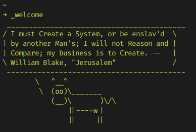

# Fortune BOT



Generate message from Fortune CLI and post in twitter!

## Configure

Copy `.env.example` to `.env` and type your twitter credentials (and your phone number) on `.env`:

```
cp .env.example .env
```

Run yarn to install dependencies:

```
yarn install
```

Also, install fortune from package manager. E.g on Debian:

```
sudo apt install fortune
```

## Start

Run:

```
yarn start
```

For debugging/dev:

```
yarn dev
```

## Production with Docker

Build image:
```
docker build . --no-cache -t bot/fortune
```


Run (**will post on twitter**):

```
docker run -it --rm --name tweet-fortune bot/fortune
```
